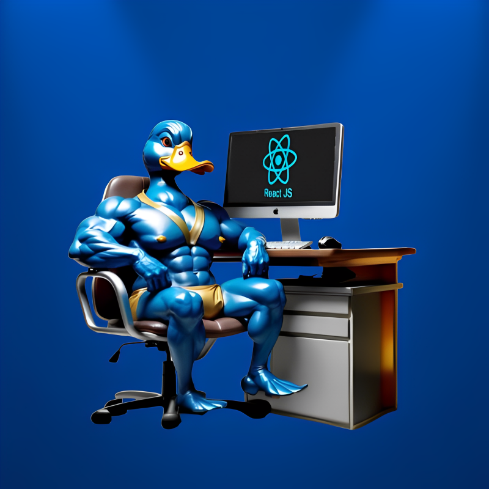

   
   <h1 align="center">Meals</h1>

---

# Sobre o Projeto

Expenses é um aplicativo simples e funcional para controle de Receitas.

---

# Layout

---

# Tecnologia Utilizada

- Flutter

---

# Autor

## @Duck.Web

   

